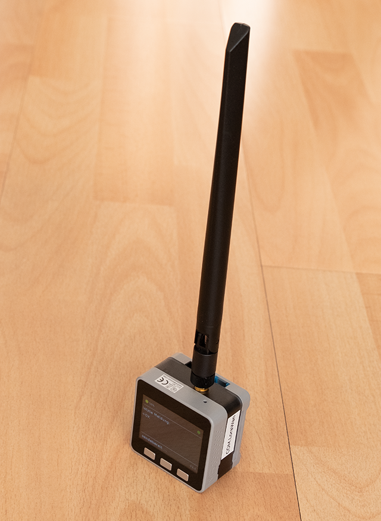
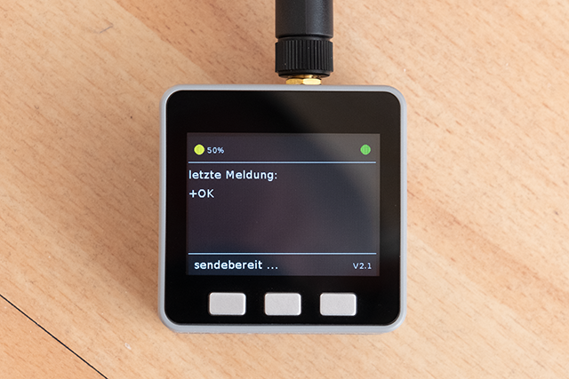
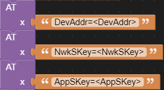

# M5Stack (Core) TTN-Mapper device

This is a ready-to-use TTN-Mapper demo code for the M5Stack Core.

Hardware:
---------
- Core: M5Stack (Basic/Grey/Fire)
- Module: COM.LoRaWAN Module 868MHz (ASR6501)
- Base: M5GO/FIRE Battery Bottom

Usage:
------

__For M5Stack Fire:__ Change the pins in UIFlow and on the module from 17/16 to 5/13.

Insert the credentials for your device in UIFlow (for ABP).

buttons:
- button B: send message
- button C: show device address

status battery:
- green outline: battery is charging
- green: 51% - 100 %
- yellow: 26 % - 50 %
- red: 0 % - 25 %
- red outline: not ready (on device initialization)

device status:
- green: ready-to-transmit
- blue: sending message
- yellow: wait
- red: not ready (on device initialization)

LED:
- flashing green: battery is charging
- flashing red: weak battery
- blue: sending message
- yellow: wait

More Information:
-----------------
- TTN-Mapper: https://ttnmapper.org/
- preview (german): https://www.bjoerns-techblog.de/2021/02/com-lorawan-modul-fuer-den-m5stack/
- first steps: https://www.hackster.io/sodoku/m5stack-com-lorawan-using-uiflow-fdcd7f
